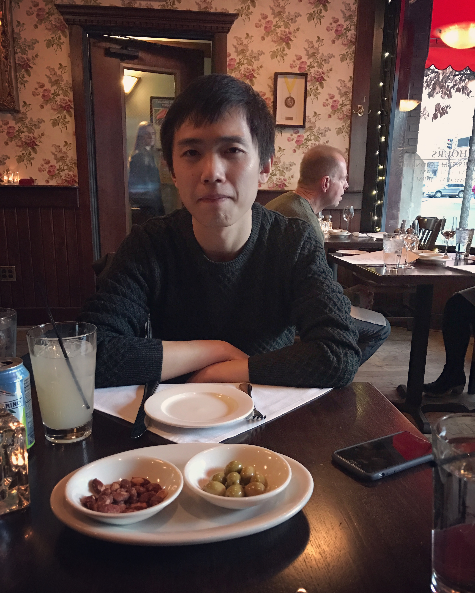

{width=25%}

\ 

Welcome to my home page. I am a PhD student at [School of Statistics, University of Minnesota, Twin Cities](http://www.stat.umn.edu/).

I am working with Professor [Charles Doss](http://users.stat.umn.edu/~cdoss/) on research problems related to nonparametric function estimation, machine learning and data visualization.

Besides my research topics, I am also interested in statistical computing and open source softwares.

In Spring 2018, I am TA for STAT8112 and STAT 8054.

I will join [Liberty Mutual Insurance](https://www.libertymutual.com/) as a Data Science intern in summer 2018.

---

# Contact 
* **Office**: 350 Ford Hall, 224 Church St SE, Minneapolis, MN 55414
* **Email**: wengx076 at umn dot edu